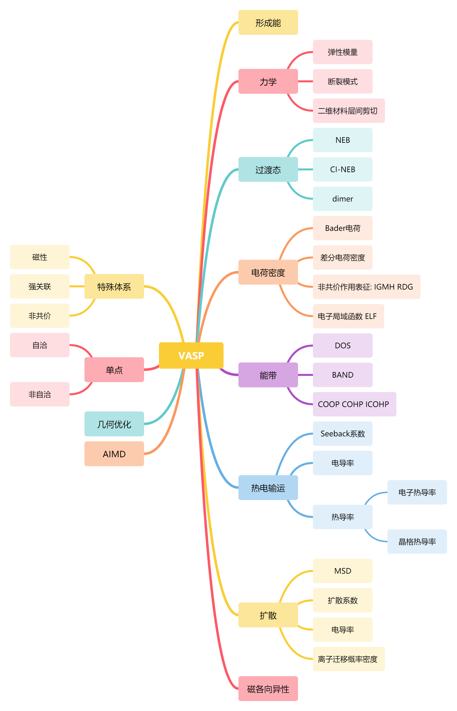

VASP计算参数总结。

<!--more-->



## Global

IO parameters
- ISTART = 1 read  wavefunction
- ICHARG = 1 read  charge density (11 for DOS and BAND)
- LWAVE = .TRUE.   write wavefunction
- LCHARG = .TRUE.  write charge density
- LELF = .FALSE.   write ELFCAR

Precision parameters  
- ENCUT = 1.3*ENMAX in POTCAR
- \#NELECT = ? number of valence electrons (Background charge)
- ADDGRID = .TRUE.  oscillations the charge density
- PREC = Accurate 
- LREAL = Auto projection done in real space


Parallel parameter
- KPAR = number of cores/KPAR for one k-point
- NCORE = cores/KPAR/NPAR
-\#NPAR = 

<br>

## SP

- ISMEAR = 0/1/-5
- SIGMA = 0.02~0.05/0.2/\
- NELM = 200
- EDIFF = 1e-5~1e-4
- \# NEDOS = 2000 
- \# LORBIT = 11 

<br>

## OPT

- NSW = 2000
- IBRION = 2(CG) 0(MD) 3(CI-NEB)
- ISIF = 2 (ions) 3 (ions/shape) 
- EDIFFG = -1e-2 ~ -5e-2 force smaller 0.02A/eV
- ISYM = 2 use symmetry 0 for AIMD
- ALGO = VeryFast (Normal for magnetic system)

<br>

## MAGMOM

- ISPIN  = 2 open spin 1 close spin
- MAGMOM = n1\*uB1 n2\*uB2 n1\*uB1 n2\*uB2 n3\*uB3 n4\*uB4
- VOSKOWN    =  0        (1 for PW91 function)
- LASPH      = .TRUE.  (Non-spherical elements, d/f convergence)
- GGA_COMPAT = .FALSE. (Apply spherical cutoff on gradient field FALSE for magnetic anisotropy)
- AMIX       =  0.2    (Mixing parameter to control SCF convergence)     
- BMIX       =  0.0001 (Mixing parameter to control SCF convergence)     
- AMIX_MAG   =  0.4    (Mixing parameter to control SCF convergence)     
- BMIX_MAG   =  0.0001 (Mixing parameter to control SCF convergence)

<br>

## DFT+U

- LDAU = .TRUE. (Activate DFT+U)
- LMAXMIX = 4 (For d elements increase LMAXMIX to 4, f: LMAXMIX = 6) 
- LDAUTYPE = 2 (Dudarev, only U-J matters)
- LDAUL =  d/f d/f d/f d/f         (Orbitals for each species 1p 2d 3f -1none)
- LDAUU = U1 U2 U3 U4
- LDAUJ = 0 0 0 0 

<br>

## NEB

- ICHAIN = 0         (Open NEB)
- LCLIMB = .TRUE.    (Choose CI-NEB)
- IOPT = 1/2/7       (7:Fast Intertial Relaxation Engine; 2:CG)
- POTIM = 0          (Use method provided by CI-NEB) 
- IMAGES = 8         (Numbers of interpolation points)
- SPRING = -5        (Spring force)


## 不同体系需要设置的参数
1. **体系性质**：SIGMA; ISMEAR; DFT+U; MAGMOM
2. **收敛参数**：EDIFF; EDIFFG; NSW; NELM
3. **非自洽计算**： ICHARG; NEDOS; LORBIT 
4. **并行参数**：NCORE; KPAR

<br><br><br><br><br><br><br><br><br>


## 自由能矫正

NFREE = 2
IBRION = 0.015
 


自动化处理脚本
- 优化+单点
- 单点+非自洽 能带
- 自由能矫正

## 经验总结-liujc

我个人通常习惯做分步结构优化。在第一步结构优化中，使用较低精度，同时设置 ISMEAR = 0 + SIGMA = 0.1，查看结构优化最后在 OUTCAR 中给出的 EENTRO 值。然后通过 EENTRO 值除以体系原子数去判断体系是半导体和金属：

1) ( EENTRO / 原子数 ) 大于 1meV，体系为金属。

2) ( EENTRO / 原子数 ) 小于 0.1meV，体系为半导体。这个值非常小时，比如 0.000001，体系带隙一般较大。

3) ( EENTRO / 原子数 ) 介于 1meV 和 0.1meV，目前还没有具体测试过，不确定。

这一判断的依据是：对于金属体系，ISMAER = 0 会使用 Gaussian smearing，导致在费米面处出现分数占据，进而导致 EENTRO 值不为 0 。而对于较大带隙的半导体，SIGMA = 0.1 还无法导致费米面处出现分数占据，EENTRO 值保持为 0（若增大 SIGMA 到一个很大的值时，EENTRO 也将不再保持为 0，但此时的计算会存在问题）。

这一判断方法是我个人的经验，目前在使用过程中大部分情况下都能给出正确的结果，但不保证对所有体系所有情况都可用。比如在弛豫过程中晶格变化非常大时，用于自洽计算对应的平面波截断球已经严重变形，可能会导致离子步的自洽收敛到的状态本身就有很大的误差。此时再在有误差的自洽结果上用这一方法进行判断是否可行，我不确定。不过解决办法也简单，再用弛豫的结构做一次弛豫就可以使用这一方法进行判断了。

# Bader Charge Calculations
## 什么是Bader电荷？

一个分子中，电荷在分子所占据的空间中并不是均匀分布的。在每两个原子之间，电荷密度分布不均匀同时越是靠近原子，电荷密度会显著提高。因此，两个较大的数值之间存在一个极小值，这个极小值就是把原子分开的界限。一个原子周围的极小值点会形成一个封闭的区域这个区域可以用来划分分子中的原子，这个区域中的电荷综合就是Bader电荷。（VASP中使用赝势，因此所计算的电荷总和是当前化学环境中的所有“价层”电子总和）

<!--more-->
## Bader电荷计算

​		[Bader](http://theory.cm.utexas.edu/henkelman/code/bader/)是用于计算Bader的软件，读入文件有两种：

1 VASP CHGCAR文件；

2 Gaussian CUBE文件 软件会自己识别文件格式，不需要手动指定。

用法

```
Bader filename
```

选项如下表：

|                选项                |                     含义                     |
| :--------------------------------: | :------------------------------------------: |
|        -c bader \| voronoi         |       开启bader计算/Voronoi多面体计算        |
|        -n bader \| voronoi         |       关闭bader计算/Voronoi多面体计算        |
|  -b neargrid \| ongrid \| weight   |            三种Bader网格划分算法             |
|       -r refine_edge_method        | 默认-1一般使用-1（新算法 高效；旧算法为-2）  |
|     **-ref reference_charge**      |  参考电荷（推荐-ref file(AECCAR0+AECCAR2)）  |
| -vac off \| auto \| vacuum_density | 默认指定低密度点给真空层（1e-3/A^3判断标准） |
|      -p all_atom \| all_bader      |                   输出选项                   |
|      -p sel_atom \| sel_bader      |               输出选项（选择）               |
|      -p sum_atom \| sum_bader      |               输出选项（求和）               |
|    -p atom_index \| bader_index    |               输出选项（指标）               |
|         -i cube \| chgcar          |         默认会自己判断，一般不设置！         |
|                -cp                 |                  选择关键点                  |
|                 -h                 |                     帮助                     |
|                 -v                 |                   冗余输出                   |

输出文件：

| 文件名  |                  内容                   |
| :-----: | :-------------------------------------: |
| ACF.dat | 坐标 电荷 到表面（内层）的最小距离 体积 |
| BCF.dat |  坐标 电荷 最近的原子 离最近原子的距离  |
| AVF.dat |                  体积                   |

**粗莽做法：**

不考虑内层电子，采用赝势的内层电子数（一般来说内层电子变化不大）

```
bader CHGCAR
```

**官方建议做法：**

考虑内层电子，考虑全电子状态

```
LAECHG =.TRUE.
LCHARG = .TRUE.
NSW    = 0
```

```
chgsum.pl AECCAR0 AECCAR2
bader CHGCAR -ref CHGCAR_sum
```


