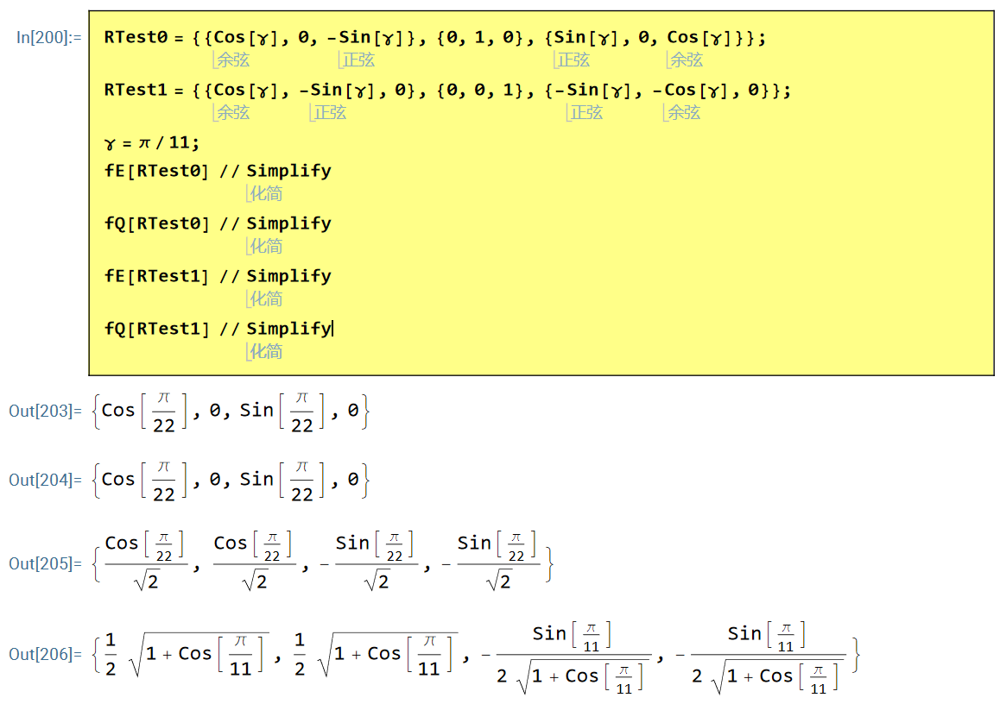
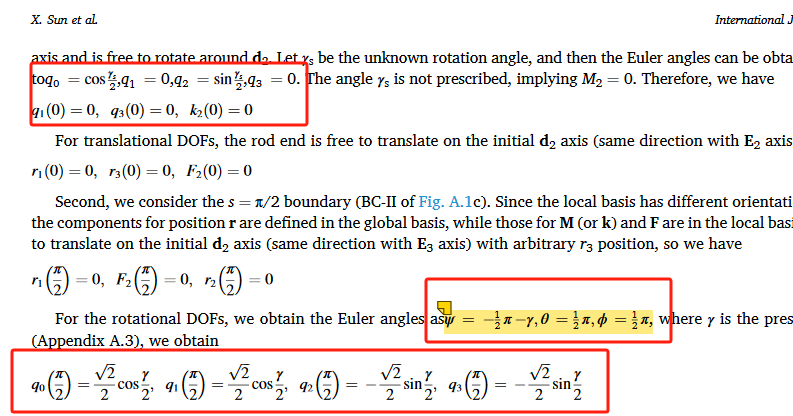
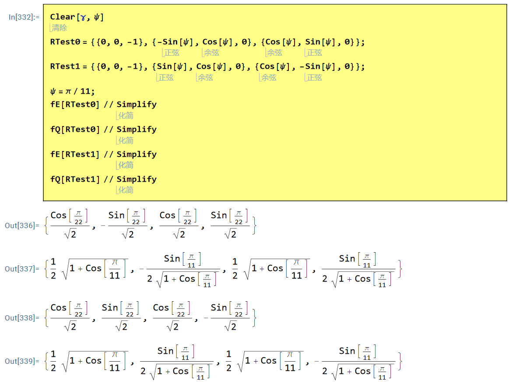
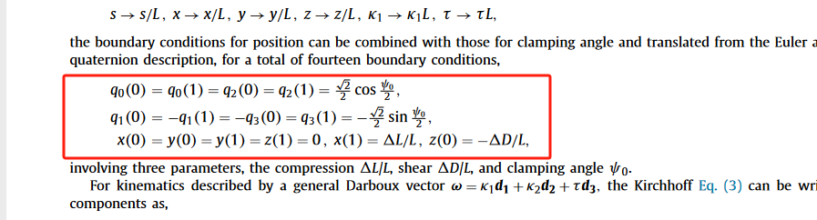

如何确定杆的边界条件？

 <!--more-->

三维空间中欧拉角的转动，当比较复杂的时候很难一次性想清楚。如何确定Kirchhoff杆正确的边界条件呢？下面给出一种直接求解的方法。

## 确定杆两端在全局和局部标架中的表达

假设全局标架表达为单位矩阵 $\mathbf{E}$，左端局部标架表达为 $\mathbf{D_0}$，右端局部标架表达为 $\mathbf{D_1}$。全局与局部标架之间通过转动矩阵变换得到：

$$
\mathbf{D}_0=\mathbf{R}_0\mathbf{E}
$$

$$
\mathbf{D}_1=\mathbf{R}_1\mathbf{E}
$$

我们只需要通过 $\mathbf{R_0}$ 和 $\mathbf{R_1}$ 求解边界条件即可。这里我们展示通过两种方法得到相同的结果，第一种方法为直接通过四元数转动矩阵求解，第二种方法为先反求具有明确物理意义的欧拉角，再通过欧拉角与四元数之间的关系求解边界条件。

## 四元数直接求解

四元数的转动矩阵为：

$$
\mathbf{Q}=\begin{pmatrix}
q_{0}^{2}+q_{1}^{2}-q_{2}^{2}-q_{3}^{2} & 2q_0q_3+2q_1q_2 & 2q_1q_3-2q_0q_2\\
2q_1q_2-2q_0q_3 & q_{0}^{2}-q_{1}^{2}+q_{2}^{2}-q_{3}^{2} & 2q_0q_1+2q_2q_3\\
2q_0q_2+2q_1q_3 & 2q_2q_3-2q_0q_1 & q_{0}^{2}-q_{1}^{2}-q_{2}^{2}+q_{3}^{2}
\end{pmatrix}
$$

通过 $\mathbf{R_0}=\mathbf{Q}$ 以及 $\mathbf{R_1}=\mathbf{Q}$ 求出对应四元数的边界条件。

首先得到：

$$
\begin{cases}
R_{23}-R_{32}=4q_0q_1\\
R_{31}-R_{13}=4q_0q_2\\
R_{12}-R_{21}=4q_0q_3\\
4q_{0}^{2}-1=R_{11}+R_{22}+R_{33}
\end{cases}
$$

其次可以反解得到：

$$
\begin{cases}
q_0=\frac{1}{2}\sqrt{R_{11}+R_{22}+R_{33}+1}\\
q_1=\frac{R_{23}-R_{32}}{2\sqrt{R_{11}+R_{22}+R_{33}+1}}\\
q_2=\frac{R_{31}-R_{13}}{2\sqrt{R_{11}+R_{22}+R_{33}+1}}\\
q_3=\frac{R_{12}-R_{21}}{2\sqrt{R_{11}+R_{22}+R_{33}+1}}
\end{cases}
$$

## 通过欧拉角求解

首先通过转动矩阵反解欧拉角（Mathematica函数 `EulerAngles`），然后利用四元数与欧拉角的关系确定边界条件。四元数与欧拉角关系为：

$$
\begin{cases}
q_0=\cos \frac{\theta}{2}\cos \frac{\psi +\phi}{2}\\
q_1=\sin \frac{\theta}{2}\sin \frac{\phi -\psi}{2}\\
q_2=\sin \frac{\theta}{2}\cos \frac{\phi -\psi}{2}\\
q_3=\cos \frac{\theta}{2}\sin \frac{\psi +\phi}{2}
\end{cases}
$$

**Note：** 这里有一点值得特别注意。之前通过四元数的变换为：

$$
\begin{pmatrix}
\mathbf{d}_1\\
\mathbf{d}_2\\
\mathbf{d}_3
\end{pmatrix}
=\mathbf{Q}
\begin{pmatrix}
\mathbf{E_1}\\
\mathbf{E_2}\\
\mathbf{E_3}
\end{pmatrix}
$$

这里标架矢量均为行矢量，但是我们一般定义转动矩阵如下：

$$
\mathbf{b}=\mathbf{R}\mathbf{a}
$$

这里 $\mathbf{a},\mathbf{b}$ 均为列矢量，标架变换写成矩阵形式为：

$$
\begin{pmatrix}
\mathbf{d}_{1}^{t} & \mathbf{d}_{2}^{t} & \mathbf{d}_{3}^{t}
\end{pmatrix}
=\mathbf{R}
\begin{pmatrix}
\mathbf{E}_{1}^{t} & \mathbf{E}_{2}^{t} & \mathbf{E}_{3}^{t}
\end{pmatrix}
$$

转置后为：

$$
\begin{pmatrix}
\mathbf{d}_1\\
\mathbf{d}_2\\
\mathbf{d}_3
\end{pmatrix}
=
\begin{pmatrix}
\mathbf{E}_1\\
\mathbf{E}_2\\
\mathbf{E}_3
\end{pmatrix}
\mathbf{R}^t
$$

由于单位矩阵是对称的，因此有：

$$
\begin{pmatrix}
\mathbf{d}_1\\
\mathbf{d}_2\\
\mathbf{d}_3
\end{pmatrix}
=\mathbf{R}^t
\begin{pmatrix}
\mathbf{E}_1\\
\mathbf{E}_2\\
\mathbf{E}_3
\end{pmatrix}
$$

从 Eq. (8) 和 Eq. (11) 可以看出：$\mathbf{Q}=\mathbf{R}^t$
这一点在利用 Mathematica 求解欧拉角的过程中需要特别注意。

## 符号计算程序

**四元数直接求解：**

```mathematica
Clear["`*"]
fQ[R_] := 
 Module[{q0, q1, q2, q3}, {q0 = 1/2 Sqrt[Tr[R] + 1], 
   q1 = (R[[2, 3]] - R[[3, 2]])/(4 q0), 
   q2 = (R[[3, 1]] - R[[1, 3]])/(4 q0), 
   q3 = (R[[1, 2]] - R[[2, 1]])/(4 q0)}]
```

**欧拉角间接求解：**

```mathematica
Clear["`*"]
fE[R_] := 
 Module[{q0, q1, q2, q3, f}, {f = EulerAngles[R // Transpose]; 
   q0 = Cos[f[[2]]/2] Cos[(f[[1]] + f[[3]])/2],
   q1 = Sin[f[[2]]/2] Sin[(f[[3]] - f[[1]])/2],
   q2 = Sin[f[[2]]/2] Cos[(f[[3]] - f[[1]])/2],
   q3 = Cos[f[[2]]/2] Sin[(f[[1]] + f[[3]])/2]}]
```
下面我们编写符号计算程序实现上面两种求解边界条件的方式，并通过案例进行验证。

## 案例一：IJSS 248 (2022) 111685

该文献中杆的左、右两端局部标架（行向量形式）分别定义为：

**左端局部标架 $\mathbf{D}_0$：**

$$
\begin{pmatrix}
\mathbf{d}_1^t \\
\mathbf{d}_2^t \\
\mathbf{d}_3^t
\end{pmatrix} = \begin{pmatrix}
\cos\gamma & 0 & -\sin\gamma \\
0 & 1 & 0\\
\sin\gamma & 0 & \cos\gamma
\end{pmatrix}
$$

**右端局部标架 $\mathbf{D}_1$：**

$$
\begin{pmatrix}
\mathbf{d}_1^t \\
\mathbf{d}_2^t \\
\mathbf{d}_3^t
\end{pmatrix}
=
\begin{pmatrix}
\cos\gamma & -\sin\gamma & 0 \\
0 & 0 & 1\\
-\sin\gamma & -\cos\gamma & 0
\end{pmatrix}
$$

将上述标架矩阵视为旋转矩阵 $\mathbf{R}$（注意此处为行向量形式，对应前文推导中的 $\mathbf{R}^T$），代入上述 Mathematica 程序中，即可解得与原文一致的边界条件（四元数 $q_0, q_1, q_2, q_3$ 的初始值）。

计算结果示意图如下：





## 案例二：JMPS 122 (2019) 657–685

该文献中杆的左、右两端局部标架（行向量形式）分别定义为：

**左端局部标架 $\mathbf{D}_0$：**

$$\left( \begin{matrix} \mathbf{d}_1^t \\ \mathbf{d}_2^t \\ \mathbf{d}_3^t \end{matrix} \right) = \left( \begin{matrix} 0 & 0 & -1 
\\ -\sin\psi & \cos\psi & 0 \\ \cos\psi & \sin\psi & 0 \end{matrix} \right)$$

**右端局部标架 $\mathbf{D}_1$：**

$$
\begin{pmatrix}
\mathbf{d}_1^t \\
\mathbf{d}_2^t \\
\mathbf{d}_3^t
\end{pmatrix}=\begin{pmatrix}
0 & 0 & -1 \\
\sin\psi & \cos\psi & 0\\
\cos\psi & -\sin\psi & 0
\end{pmatrix}
$$

同理，将上述矩阵代入 Mathematica 程序，即可得到对应的四元数边界条件，结果与原文一致。

计算结果示意图如下：



