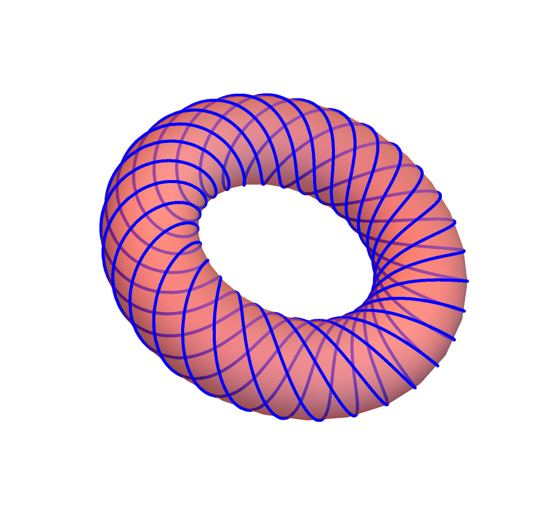
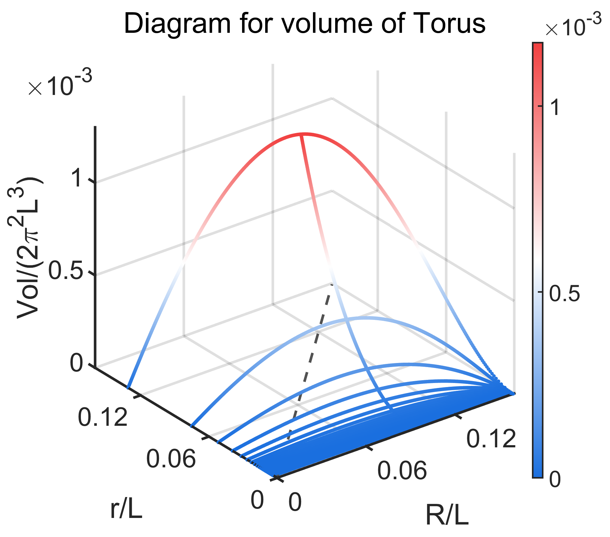
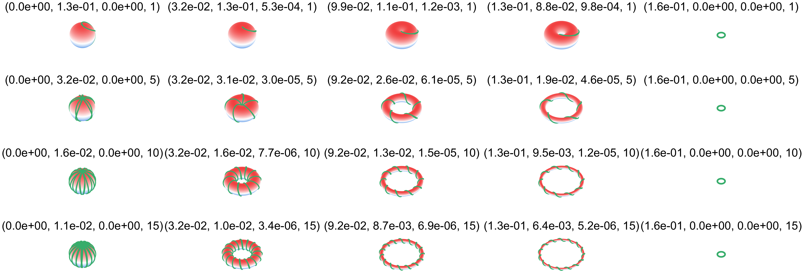

假设纤维螺旋缠绕在环上，肌肉纤维长度给定的情况下，要想体积最大，肌肉纤维的螺旋倾角应该为多少度？

<!--more-->

## 螺旋线纤维缠绕圆柱的最大体积

假设线虫是由肌肉纤维螺旋缠绕在圆柱上组成，肌肉纤维长度给定的情况下，要想体积最大，肌肉纤维的螺旋倾角应该为多少度？

见J. B. Cowey ([J Cell Sci* (1952) s3-93 (21): 1–15.](https://journals.biologists.com/jcs/article/s3-93/21/1/64065))的工作。
$
V=\pi R^2*L=\frac{1}{4\pi} D^3 \sin^2\theta \cos\theta
$
体积最大时有 $\cos\theta=\frac{1}{\sqrt{3}}$。

## 纤维复合Torus的最大体积 

假设纤维缠绕$k$圈，纤维的参数方程可以写为：
$
p(\theta)=\{\cos\theta (R-r \cos k\theta),\sin \theta  (R-r \cos k\theta ),r \sin k\theta \}
$
纤维长度可以写作：
$
ds=\sqrt{k^2r^2+(R-r\cos k\theta)^2}d\theta
$
固定纤维长度，有：
$
\int_0^{2\pi}\sqrt{k^2r^2+(R-r\cos k\theta)^2}d\theta=L
$
Torus的体积为：
$
V=2\pi^2r^2R
$
问题转化为在纤维长度$L$以及环绕圈数$k$固定的时候求体积极大值，长度用$L$，体积用$2\pi^2L^3$无量纲化，问题转化为：
$
\int_0^{2\pi}\sqrt{k^2r^2+(R-r\cos k\theta)^2}d\theta=1, k=1,2,3......N\\
V=r^2R|_{max},  \ \ \ \ \ \ \ \ \ \ \ \ \ \ \{r,R\}
$
假设$\Lambda$为拉格朗日乘子，有：
$
\mathcal{L}=r^2R-\Lambda(\int_0^{2\pi}\sqrt{k^2r^2+(R-r\cos k\theta)^2}d\theta-1)\\
Variables:\{r,R,\Lambda \}
$
求偏导有：
$
\frac{\partial \mathcal{L}}{\partial \Lambda}=\int_0^{2\pi}{\sqrt{k^2r^2+(R-r\cos k\theta )^2}}d\theta -1=0
\\
\frac{\partial \mathcal{L}}{\partial r}=2rR-\Lambda \int_0^{2\pi}{\frac{k^2r+kr\cos ^2\theta -R\cos \theta k}{\sqrt{k^2r^2+(R-r\cos k\theta )^2}}}d\theta =0
\\
\frac{\partial \mathcal{L}}{\partial R}=r^2-\Lambda \int_0^{2\pi}{\frac{R-r\cos \theta k}{\sqrt{k^2r^2+(R-r\cos k\theta )^2}}}d\theta =0
$
数值求解Eq. (8), 可以得到Torus的优化值，如下图：

绘制不同缠绕数情况下的Torus，数组表示含义为$(R/L, r/L, Vol/L^3)$：

