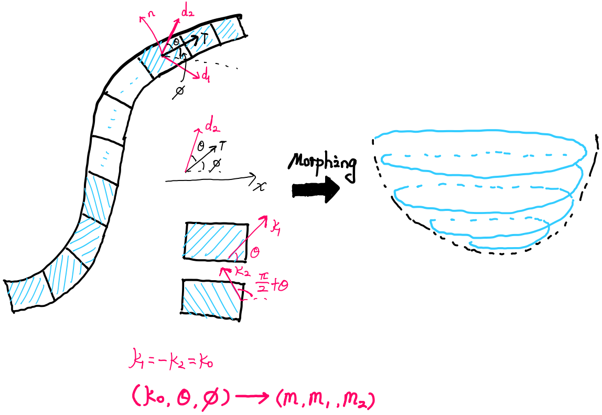

# The General theory for BTM

We consier a morphing slender kirgami ribbon for conformable deformation. The movement equation of the principal curvatrue frame can be written as:

$$
\partial_s\left( \begin{array}{c}
	\mathbf{d}_1\\
	\mathbf{d}_2\\
	\mathbf{n}\\
\end{array} \right)=\left( \begin{matrix}
0&		-(\theta'+\phi')&		(\kappa_2-\kappa_1)\sin\theta\cos\theta\\
\theta'+\phi'&		0&		-\kappa_1\sin^2\theta-\kappa_2\cos^2\theta\\
(\kappa_1-\kappa_2)\sin\theta\cos\theta&		\kappa_1\sin^2\theta+\kappa_2\cos^2\theta&		0\\
\end{matrix} \right)\left( \begin{array}{c}
	\mathbf{d}_1\\
	\mathbf{d}_2\\
	\mathbf{n}\\
\end{array} \right)
$$

The movement equation of the twisted Frenet frame can be written as:

$$
\partial_s\left( \begin{array}{c}
	\mathbf{B}_1\\
	\mathbf{T}\\
	\mathbf{N}_1\\
\end{array} \right)=\left( \begin{matrix}
0&		-\kappa\sin\varphi&		\varphi'-\tau\\
\kappa\sin\varphi&		0&		\kappa\cos\varphi\\
\tau-\varphi'&		-\kappa\cos\varphi&		0\\
\end{matrix} \right)\left( \begin{array}{c}
	\mathbf{B}_1\\
	\mathbf{T}\\
	\mathbf{N}_1\\
\end{array} \right)
$$

We can also write the movement of the ribbon as material strain:

$$
\partial_s\left( \begin{array}{c}
	\mathbf{d}_1\\
	\mathbf{d}_2\\
	\mathbf{d}_3\\
\end{array} \right)=\left( \begin{matrix}
0&		m&		m_1\\
-m&		0&		m_2\\
-m_1&		-m_2&		0\\
\end{matrix} \right)\left( \begin{array}{c}
	\mathbf{d}_1\\
	\mathbf{d}_2\\
	\mathbf{d}_3\\
\end{array} \right)
$$

Finally we have the equation for inverse design:

$$
\begin{cases}
(\kappa_2-\kappa_1)\sin\theta\cos\theta=m_1\\
\kappa_1\sin^2\theta+\kappa_2\cos^2\theta=m_2\\
\phi'=-m-\theta'
\end{cases}
$$

When $\kappa_2=-\kappa_1$, we have:

$$
\begin{cases}
\phi'=-m-\theta' \\
\tan2\theta=-\frac{m_1}{m_2}\\
\kappa_1=\frac{m_2}{\cos2\theta}
\end{cases}
$$

