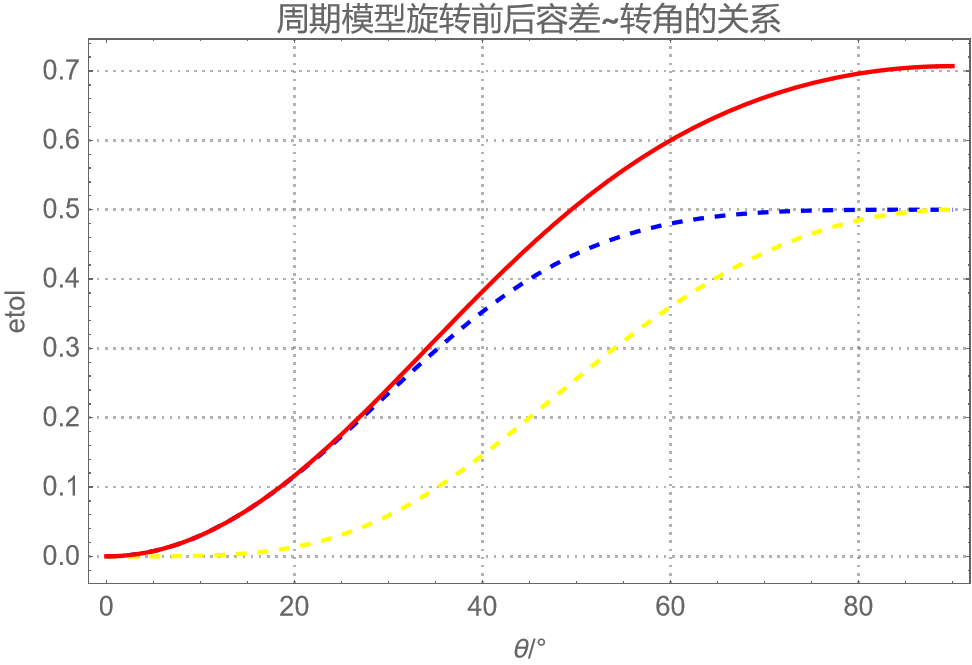
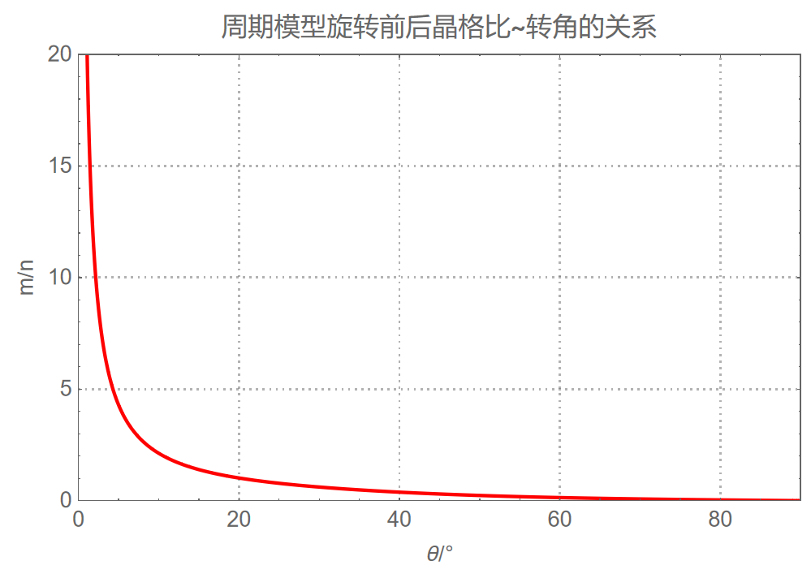

**如何对具有周期性的模型进行旋转？**
<!--more-->
## 几何关系

假设左图是材料的最小周期型单元，经过旋转后得到右图的模型。要想满足周期性边界条件，假设$d_x$方向上有$n$个周期，$d_y$方向上有$m$个周期。需满足如下关系式：
$
l_x=md_y \sin\theta
$
$
l_y=md_y \cos\theta  
$
$
nd_x=\frac{l_x}{\cos\theta}
$
得到：$tan\theta=\frac{n}{m}\frac{d_x}{d_y}$  

同时需要满足体积守恒 $ d_x d_y m n=l_x l_y $   

最终解得：
$
\sin\theta \cos\theta=\tan\theta
$
~~只有$\theta=k\pi $时成立，也就是说除了转动180度的倍数，不存在旋转后仍未周期性的体系，晶格常数必然发生失配。~~
既然晶格常数无法满足旋转的要求，要想让容差率达到最小，应该如何做？

## 数值近似解

假设初始晶格比$d_y/d_x=8/3$，蓝线为旋转后的体积容差，黄线为旋转后的横向键长容差，红线为总容差。

我们修改(1)式，引入容差$\Delta \varphi$来描述体积的变化率，$\gamma$来描述横向键长的变化（$\Delta\varphi$在0附近，$\gamma$在1附近）：
$
l_x=md_y \sin\theta 
$
$
l_y=md_y \cos\theta 
$

$
nd_x*\gamma=\frac{l_x}{\cos\theta}
$

$
nmd_xd_y*(1+\Delta\varphi)=l_xl_y
$

定义误差函数$etol=(\Delta\varphi)^2+(\gamma-1)^2$，最终求得误差以及晶格比与角度的变化。

$
etol=\sqrt{(\lambda tol)^2+(\Delta \varphi tol)^2}=\sqrt{\left(\lambda  p \tan \left( \theta\right)-1\right)^2+\left(\lambda  p \sin ^2\left( \theta\right) \tan \left( \theta\right)\right)^2}
$
误差函数的极小值可以解析求解为：
$
etol_{,p}=0
$
$
p=\frac{\cot\theta}{\lambda(1+\sin^4\theta)}
$
$
\lambda tol=\frac{1}{1+\sin^4\theta}-1
$
$
e\Delta\varphi=\frac{\sin^2\theta}{1+\sin^4\theta}
$
$
etol=\frac{\sin^2\theta}{\sqrt{1+\sin^4\theta}}
$
旋转前后的最佳晶格比为：

可以看出，要想将容差控制在大约10%以内，取向角被限制在0~20度。

## 范例

S2层粗粒化模型元胞满足$p=m/n=d_y/d_x=8/3$，对于不同的$m,n$取向角$\theta$可以取不同的值。

|  n   |  m   |    p     | $ \theta $ | $l_x $  | $l_y $  |
| :--: | :--: | :------: | :--------: | :-----: | :-----: |
|  10  |  21  |  2.1248  |     10     | 87.5187 | 496.343 |
|  1   |  1   |  1.0164  |     20     | 8.20848 | 22.5526 |
|  16  |  10  | 0.611312 |     30     |   120   | 207.846 |
|  21  |  10  | 0.483251 |     35     | 137.658 | 196.596 |

**旋转周期性模型需要用倾斜的盒子！**

