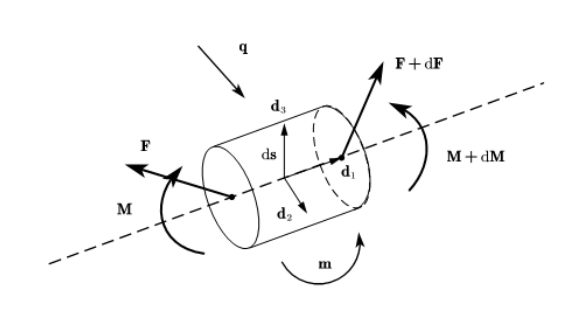
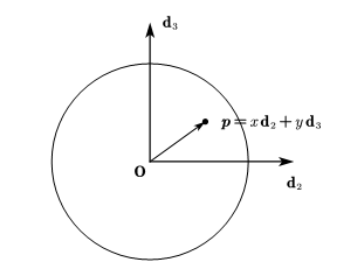

**不可拉伸弹性杆为什么可解？**
<!--more-->
## 前言

 一直想写一篇文章来解释弹性杆的原理但是迫于能力问题，迟迟没有下笔。弹性杆在生活中有着广泛的应用，下面简单列举几个。

- 为什么有的植物藤曼是螺旋状的，有的是平面曲线？
- 葡萄的藤曼是如何爬上支架的？蛇是如何运动的？（包括平面上的运动，曲面上的运动：蛇爬树）
- 如何更可靠的铺设海底电缆？
- 捏住绳子的两端反向揉搓，为什么绳子中间会变成麻花形状？
- 悬链线的形状，[弹性悬链线](https://lijh0417.github.io/2022/10/09/%E5%BC%B9%E6%80%A7%E6%82%AC%E9%93%BE%E7%BA%BF%E9%97%AE%E9%A2%98/)，考虑弯曲能的弹性悬链线形状的形状？
- DNA结构是如何由力学主导的？
- 莫比乌斯带中的应力分布?（Mahadevan L 1993）
- 竹笋是如何生长成变圆锥状的？

弹性杆的应用有很多，这里就不一一列举了。事实上，历史上很多著名的问题都是弹性杆的特例，如悬链线问题、弹性悬链线问题、扭转失稳（twist bulking），绳子下落问题等。此外，很多著名的科学家都对弹性杆的研究做出了贡献，如Euler; Kirchhoff; Bernoulli; Bonn等。此外，弹性杆需要用到古典微分几何的知识，应当意识到弹性杆不仅仅与曲线论密切相关，更与流形上的弹性结构有着密切关系。这并不是脱离实际的，线状弹性问题约束在一个曲面（二维流形）上运动时，流形上的弹性理论也许能发挥重要作用。（蛇爬树就是很现实的一个例子。） 上世纪末，David Singer & Langer 曾经研究了黎曼流形上的Euler弹性杆，这仅仅是考虑了弯曲能的静态解，这方面还有很多路要走。

这里主要是想说明两个问题：

- 1 弹性杆的运动与哪些物理量有关， 弹性杆的运动为什么是可解的？
- 2 弹性杆研究的困难在哪里？

需要提前说明的是，妄想掌握了弹性杆的框架之后就能通过PDE数值方法去求解任意弹性杆的运动是不现实的。即使不需要任何理论，仅仅凭我们的生活常识就能看到，一些绳子扭结之后曲率的变化是非常大的，这往往会导致数值算法的失效。其次，即使对于ODES的两点边界条件，初值的猜测是困难的，很多时候需要结合物理场景。matlab自带的打靶法求解函数bvp4c, bvp5c的使用被描述为"更多的是一种艺术而不是技术"，可以想象对于一些复杂边界条件弹性杆方程求解更是难上加难了。近年来，离散弹性杆(Discrete Elasic Rod)的产生使得可以通过使用计算机仿真很多弹性杆力学行为。本质上讲，离散弹性杆(DER)的研究更多的是为了解决数值困难而不是物理理论。

## 概览：与那些物理量有关？

无论是板壳理论还是弹性杆，都是弹性力学衍生出的简化理论，这种简化是由几何对称性得到的。如同连续介质力学中一样，问题求解离不开三个部分：几何方程，物理方程，平衡方程。
$
\{\boldsymbol{u}, \boldsymbol{v}, \boldsymbol{\omega}, \boldsymbol{k}, \mathbf{M}, \mathbf{Q}, \boldsymbol{\theta}\}
$
上述七个量共有21个分量，全部是关于杆弧长坐标以及时间的函数。

**物理意义如下：**

|        物理量         |     物理意义     |
| :-------------------: | :--------------: |
|   $\boldsymbol{u}$    |       位移       |
|   $\boldsymbol{v}$    |       速度       |
| $\boldsymbol{\omega}$ |  时间Daboux矢量  |
|   $\boldsymbol{k}$    |  空间Daboux矢量  |
|     $\mathbf{M}$      |      内力矩      |
|     $\mathbf{Q}$      |       内力       |
| $\boldsymbol{\theta}$ | 欧拉角（四元数） |

**弹性杆解的七个方程：**

- 1 Kirchoff 平衡方程 2
- 2 时空几何变换方程（Rotate Tensor与（欧拉角/四元数）的关系） 2
- 3 速度及切矢量物理方程 （速度与位移的关系 位移与切矢量关系Frenet方程） 2
- 4 本构方程 1
- 每个方程有三个分量一共 21 个分量形式的方程，除此之外，还有Frenet方程，把位移，内力，内力矩展开为局部坐标并求导时会用到这个几何关系。

|                             方程                             |       物理意义       |
| :----------------------------------------------------------: | :------------------: |
| $\frac{\partial \mathbf{F}}{\partial s}+\boldsymbol{q}=\rho \mathbf{A} \ddot{\boldsymbol{r}}$ |       受力平衡       |
| $\frac{\partial \mathbf{M}}{\partial s}+\frac{\partial \boldsymbol{r}}{\partial s} \times \mathbf{F}+\mathbf{m}=\mathrm{I}_{3} \mathbf{d}_{2} \times \ddot{\boldsymbol{d}}_{2}+\mathrm{I}_{2} \mathbf{d}_{3} \times \ddot{\boldsymbol{d}}_{3}$ |       力矩平衡       |
| $\dot{\boldsymbol{r}}=\frac{\partial \boldsymbol{u}}{\partial t}$ |     速度位移关系     |
| $\mathbf{d}_{1}=\frac{\partial \boldsymbol{u}}{\partial s}$  |    切矢量位移关系    |
| $\boldsymbol{\Gamma}=\mathbf{R}_{s} \mathbf{R}^{\mathbf{T}}$ | 空间旋转矢量与欧拉角 |
| $\boldsymbol{\Omega}=\mathbf{R}_{t} \mathbf{R}^{\mathbf{T}}$ | 时间旋转矢量与欧拉角 |
|             $\mathbf{M}=\rm{EI}(\boldsymbol{\Gamma})$              |     广义胡克定律     |

## 弹性的来源：本构关系

在我小时候，家里开着一间杂货铺，售卖各种型号的金属丝。有一些个有意思的现象：把细的铁丝折弯之后，铁丝很容易恢复到原来的形状，粗铁丝却不行；同样粗的金属丝，铁丝折弯后能很快恢复到原来的形状，铅丝却不行。如果熟悉Euler梁，应该可以理解这个现象，抗弯刚度：$\mathrm{D}=\mathrm{EI}$,$\text { E\&I }$ 分别为截面惯性矩和杨氏模量。对于圆截面：$\mathbf{I}=\frac{\mathrm{A}^{2}}{2 \pi}=\frac{\pi \mathrm{r}^{4}}{2}$。可以看出反应铁丝的“粗细”， 反映了铁丝的种类。两个量的组合反映了铁丝的弯曲变形与外力的关系。对于同一材料，弹性极限确定，抗弯刚度越大越容易达到弹性极限，进入塑性阶段，这解释了为什么粗的铁丝弯曲后不容易恢复。伯努利假设：通过平截面假设得到了弯曲的本构关系：$M=\mathrm{EI}\kappa$。   

$
\boldsymbol{M}=M_{i} \boldsymbol{d}_{i} \\
$
$
M_{1}=G J m   
$
$
M_{2}=E I_{2} m_{1} 
$
$
M_{3}=E I_{3} m_{2}
$

## 几何相容关系

### 四元数，欧拉角及其与 Frame Tensor 的关系

首先，给出Frame Tensor 的一些性质以及与Rotate Tensor, Daboux Vector之间的关系。这里提前说明一点，用$s$作为变量只是为了方便起见，并不具有物理意义，这里并没有说局部标架是通过时间对初始标架进行变换的还是通过弧长参数对初始标架进行变换得到。

[如何从张量的观点看待曲线论？](https://lijh0417.github.io/2022/11/19/%E5%A6%82%E4%BD%95%E4%BB%A5%E5%BC%A0%E9%87%8F%E7%9A%84%E8%A7%82%E7%82%B9%E7%9C%8B%E5%BE%85%E6%9B%B2%E7%BA%BF%E8%AE%BA%EF%BC%9F/)
$
\left\{\begin{array}{l}
\Omega+\Gamma=0 \\
\Gamma=\epsilon \cdot \omega \\
\omega=\frac{1}{2} \epsilon: \Gamma \\
\frac{1}{2} \epsilon: \Omega+\omega=0 \\
\epsilon \cdot \omega+\Omega=0
\end{array}\right.
$

$
\Gamma_{i}^{j}=\frac{d R_{i}^{m}}{d s} R_{j}^{m}+R_{i}^{n} \Gamma_{0 n}^{m} R_{j}^{m}
$

各种坐标系的特征量如下：

|                            |                         Bishop Frame                         |                         Frenet Frame                         |                        Material Frame                        |                        General Frame                         |
| :------------------------: | :----------------------------------------------------------: | :----------------------------------------------------------: | :----------------------------------------------------------: | :----------------------------------------------------------: |
| **Frame Tensor** $\Gamma$  | $\left(\begin{array}{ccc}0 & \kappa_{1} & \kappa_{2} \\ -\kappa_{1} & 0 & 0 \\ -\kappa_{2} & 0 & 0\end{array}\right)$ | $\left(\begin{array}{ccc}0 & \kappa & 0 \\ -\kappa & 0 & \tau \\0 & -\tau & 0\end{array}\right)$ | $\left(\begin{array}{ccc}0 & m_{1} & m_{2} \\ -m_{1} & 0 & m \\ -m_{2} & -m & 0\end{array}\right)$ | $\left(\begin{array}{ccc}0 & \omega_{3} & -\omega_{2} \\ -\omega_{3} & 0 & \omega_{1} \\\omega_{2} & -\omega_{1} & 0\end{array}\right)$ |
| **Rotate Tensor** $\Omega$ |                          $-\Gamma$                           |                          $-\Gamma$                           |                          $-\Gamma$                           |                          $-\Gamma$                           |
| **Daboux Tensor** $\omega$ | $-\kappa_{2} \boldsymbol{d}_{2}+\kappa_{1} \boldsymbol{d}_{3}$ |     $\tau \boldsymbol{d}_{1}+\kappa \boldsymbol{d}_{3}$      | $m \boldsymbol{d}_{1}-m_{2} \boldsymbol{d}_{2}+m_{1} \boldsymbol{d}_{3}$ | $\omega_{1} \boldsymbol{d}_{1}+\omega_{2} \boldsymbol{d}_{2}+\omega_{3} \boldsymbol{d}_{3}$ |

换句话说，之所以产生Material Frame, Bishop Frame的原因是：弹性杆无论是绕着$\boldsymbol{d}_2$还是$\boldsymbol{d}_3$转动都表现为弯曲，而绕着$\boldsymbol{d_1}$转动则表现为扭转，这表明了曲线特有的对称性（更说明了几何对称性带来的简化在连续介质力学理论应用中的重要性）。这种对称性决定了无论空间标架怎么选取，第一个随体标架基选择切矢量总是一种比较好的方式，(3)式表明各种Frame的Frame Tensor都可以由General Frame绕着$\boldsymbol{d_1}$轴旋转得到，这是Bishop Frame, Material Frame的参数命名关于$\boldsymbol{d_1}$对称的原因。

[Whittaker, E. T.](https://eclass.uoa.gr/modules/document/file.php/PHYS181/%CE%92%CE%B9%CE%B2%CE%BB%CE%B9%CE%B1/Whittaker.pdf)给出了固有坐标到随体坐标变换中四元数与Frenet张量的关系。
$
\begin{array}{c}
\left(\begin{array}{l}
\boldsymbol{d}_{1} \\
\boldsymbol{d}_{2} \\
\boldsymbol{d}_{3}
\end{array}\right)=\mathbf{R}\left(\begin{array}{l}
\boldsymbol{e}_{1} \\
\boldsymbol{e}_{2} \\
\boldsymbol{e}_{3}
\end{array}\right)\left(\begin{array}{l}
\boldsymbol{d}_{1 s} \\
\boldsymbol{d}_{2 s} \\
\boldsymbol{d}_{3 s}
\end{array}\right)=\boldsymbol{\Gamma}\left(\begin{array}{l}
\boldsymbol{d}_{1} \\
\boldsymbol{d}_{2} \\
\boldsymbol{d}_{3}
\end{array}\right) \\
\left(\begin{array}{c}
\boldsymbol{d}_{1 s} \\
\boldsymbol{d}_{2 s} \\
\boldsymbol{d}_{3 s}
\end{array}\right)=\mathbf{R}_{s}\left(\begin{array}{l}
\boldsymbol{e}_{1} \\
\boldsymbol{e}_{2} \\
\boldsymbol{e}_{3}
\end{array}\right)=\boldsymbol{\Gamma}\left(\begin{array}{l}
\boldsymbol{d}_{1} \\
\boldsymbol{d}_{2} \\
\boldsymbol{d}_{3}
\end{array}\right)=\boldsymbol{\Gamma} \mathbf{R}\left(\begin{array}{l}
\boldsymbol{e}_{1} \\
\boldsymbol{e}_{2} \\
\boldsymbol{e}_{3}
\end{array}\right)
\end{array}
$

$
\boldsymbol{\Gamma}=\mathbf{R}_{s} \mathbf{R}^{\mathbf{T}}
$
当转动矩阵表示为四元数形式时，得到Frame张量与四元数的关系，表示为欧拉角形式时得到Frame张量与欧拉角的关系。其实两者无所谓，Frame Tensor的三个张量看似得到了三个方程，其实对于四元数表示转动会外加一个隐含的约束：$q_{0}^{2}+q_{1}^{2}+q_{2}^{2}+q_{3}^{2}=1$，这使得对于无论是$\alpha, \beta, \gamma$三个参数由欧拉角表示的转动，还是四个参数由四元数表示的转动，Frame Tensor与转动参数之间的关系都是可解的。这是解算弹性杆运动中的一个重要的几何关系，因为一般死载 (dead load) 载都是表示在固有坐标中的，而弹性杆运动方程是在局部坐标中建立的。
一些关于四元数和欧拉角的计算函数。
(5)式表明，以下三个矩阵是等价的：

|                   Frame Tensor (Material)                    |              $\rm R_sR^{T}$(Euler form(3,2,3))               |               $\rm R_sR^{T}$(Quaternion form)                |
| :----------------------------------------------------------: | :----------------------------------------------------------: | :----------------------------------------------------------: |
| $\left(\begin{array}{ccc}0 & m_{1} & m_{2} \\ -m_{1} & 0 & m \\ -m_{2} & -m & 0\end{array}\right)$ | $\left(\begin{array}{ccc}0 & -\alpha_{s}-\cos (\beta) \gamma_{s} & \sin (\alpha) \sin (\beta) \gamma_{s}+\cos (\alpha) \beta_{s} \\\alpha_{s}+\cos (\beta) \gamma_{s} & 0 & \sin (\alpha) \beta_{s}-\cos (\alpha) \sin (\beta) \gamma_{s} \\ -\sin (\alpha) \sin (\beta) \gamma_{s}-\cos (\alpha) \beta_{s} & \cos (\alpha) \sin (\beta) \gamma_{s}-\sin (\alpha) \beta_{s} & 0\end{array}\right)$ | $\left(\begin{array}{ccc}0 & 2\left(q_{3} q_{0 s}-q_{0} q_{3 s}+q_{2} q_{1 s}-q_{1} q_{2 s}\right) & 2\left(-q_{2} q_{0 s}+q_{0} q_{2 s}+q_{3} q_{1 s}-q_{1} q_{3 s}\right) \\2\left(-q_{3} q_{0 s}+q_{0} q_{3 s}-q_{2} q_{1 s}+q_{1} q_{2 s}\right) & 0 & 2\left(q_{1} q_{0 s}-q_{0} q_{1 s}+q_{3} q_{2 s}-q_{2} q_{3 s}\right) \\2\left(q_{2} q_{0 s}-q_{0} q_{2 s}-q_{3} q_{1 s}+q_{1} q_{3 s}\right) & 2\left(-q_{1} q_{0 s}+q_{0} q_{1 s}-q_{3} q_{2 s}+q_{2} q_{3 s}\right) & 0\end{array}\right)$ |

四元数、欧拉角与Frame Tensor的关系为：
$
\left\{\begin{array}{l}m_{1}=2(q_{3} q_{0s} -q_{0} q_{3s}+q_{2} q_{1s} -q_{1} q_{2s})= - \alpha_s - \cos(\beta) \gamma_{s}\\
m_{2}=2(-q_{2} q_{0s}+q_{0} q_{2 s}+q_{3} q_{1 s}-q_{1} q_{3 s})=\sin (\alpha) \sin (\beta) \gamma_{s}+\cos(\alpha) \beta_{s}
\\m=2(q_{1} q_{0 s}-q_{0} q_{1 s}+q_{3} q_{2 s}-q_{2} q_{3 s})=\sin(\alpha)\beta_{s}- \cos (\alpha) \sin(\beta) \gamma_{s}\end{array}\right.
$
### 时间 Davoux Vector 与空间 Daboux Vector 的关系

弹性杆上点的运动涉及两个自变量，时间$t$与空间$s$，自然需要两套Frame Tensor来
把局部标价对两自变量的偏导数与局部标价联系起来。

一般的，考虑弹性杆方程中的物理量$\mathbf{A}(\mathrm{s}, \mathrm{t})=\mathrm{A}_{\mathrm{i}}(\mathrm{s}, \mathrm{t}) \mathbf{d}_{\mathrm{i}}(\mathrm{s}, \mathrm{t})$ ，并要求对于时间，空
间的二阶偏导数是可交换的。（为什么这么要求？可能是实际中要求物理量是 的，可
以类比应力波中的位移。利用时空二阶偏导可交换的性质，可以得到速度梯度等于应变
率这一结论。）
$
\frac{\partial^{2} \mathbf{A}}{\partial \mathrm{s} \partial \mathrm{t}}=\frac{\partial^{2} \mathbf{A}}{\partial t \partial s}
$
不妨考虑$\rm \boldsymbol{A}_i(s,t)$恒定的情况，由(5)式得到：
$
\mathrm{A}_{i} \frac{\partial\left(\omega \times \mathbf{d}_{i}\right)}{\partial \mathrm{s}}=\mathrm{A}_{i} \frac{\partial\left(\mathbf{k} \times \mathbf{d}_{i}\right)}{\partial \mathrm{t}}
$

$
\begin{aligned}
\mathrm{A}_{i}\left(\omega_{s} \times \mathbf{d}_{i}+\omega \times\left(\mathbf{k} \times \mathbf{d}_{i}\right)\right) & =\mathbf{A}_{i}\left(\mathbf{k}_{s} \times \mathbf{d}_{i}+\mathbf{k} \times\left(\omega \times \mathbf{d}_{i}\right)\right)
\end{aligned}
$

$
\begin{aligned}
\omega_{s} \times \mathbf{A}+\omega \times(\mathbf{k} \times \mathbf{A}) =  \ & \mathbf{k}_{t} \times \mathbf{A}+\mathbf{k} \times(\omega \times \mathbf{A})
\end{aligned}
$

利用Jacobi恒等式 $\omega \times(\mathbf{k} \times \mathbf{A})+\mathbf{k} \times(\mathbf{A} \times \omega)+\mathbf{A} \times(\omega \times \mathbf{k})=0$ 得到:
$
\left(\omega_{s}-\mathbf{k}_{t}+\omega \times \mathbf{k}\right) \times \mathbf{A}=0
$
$\rm \boldsymbol{A}$ 是任意的，得到恒等式：$\left(\omega_{s}-\mathbf{k}_{t}+\omega \times \mathbf{k}\right)=0$

利用Daboux Vectror与Frame Tensor的关系 $\omega=\frac{1}{2} \epsilon: \Gamma $ 可以得到:
$
\boldsymbol{\Omega}_{s}-\mathbf{K}_{t}=[ \mathbf{K},\boldsymbol{\Omega}]
$
$\rm \boldsymbol{\Omega},\boldsymbol{K}$ 分别为 $\omega,k$ 对应的Frame Tensor。

**这是一个冗余方程，因为：**

由Frenet Tensor与转动张量的关系给出：
$
\begin{cases}
	\mathbf{K}=\mathbf{R}_s\mathbf{R}^{\mathbf{T}}\\
	\mathbf{\Omega }=\mathbf{R}_t\mathbf{R}^{\mathbf{T}}\\
\end{cases}
$
考虑转动张量的性质：$\mathbf{RR}^{\mathbf{T}}=\mathbf{R}^{\mathbf{T}}\mathbf{R}=\mathbf{E}$，对上式求导得：$\mathbf{R}_s\mathbf{R}^{\mathbf{T}}+{\mathbf{RR}^{\mathbf{T}}}_s=\mathbf{R}_t\mathbf{R}^{\mathbf{T}}+{\mathbf{RR}^{\mathbf{T}}}_t=0$，化简得到：
$
\begin{cases}
	{\mathbf{R}^{\mathbf{T}}}_s=-\mathbf{R}^{\mathbf{T}}\mathbf{R}_s\mathbf{R}^{\mathbf{T}}\\
	{\mathbf{R}^{\mathbf{T}}}_t=-\mathbf{R}^{\mathbf{T}}\mathbf{R}_t\mathbf{R}^{\mathbf{T}}\\
\end{cases}
$
由(14)式得：
$
\begin{aligned}
\mathbf{\Omega }_s-\mathbf{K}_t=\mathbf{R}_{ts}\mathbf{R}^{\mathbf{T}}+\mathbf{R}_t{\mathbf{R}^{\mathbf{T}}}_s\\ -\mathbf{R}_{st}\mathbf{R}^{\mathbf{T}}-\mathbf{R}_s{\mathbf{R}^{\mathbf{T}}}_t
\\
=\mathbf{R}_t{\mathbf{R}^{\mathbf{T}}}_s-\mathbf{R}_s{\mathbf{R}^{\mathbf{T}}}_t
\\
=\mathbf{R}_s\mathbf{R}^{\mathbf{T}}\mathbf{R}_t\mathbf{R}^{\mathbf{T}}-\mathbf{R}_t\mathbf{R}^{\mathbf{T}}\mathbf{R}_s\mathbf{R}^{\mathbf{T}}=\left[ \mathbf{K},\mathbf{\Omega } \right]\end{aligned}
$

### 速度与位移

利用局部标架基，可以把弹性杆的速度和位移表示为如下形式：

$
\left\{\begin{array}{l}
\dot{\boldsymbol{r}}=\frac{\partial \boldsymbol{u}}{\partial t} \\
\mathbf{d}_{1}=\frac{\partial \boldsymbol{u}}{\partial s}
\end{array}\right.
$

## 物理平衡

Kirchhoff [Über das Gleichgewicht und die Bewegung einer elastischen Scheibe](https://gdz.sub.uni-goettingen.de/download/pdf/PPN243919689_0040/PPN243919689_0040.pdf)

### 力平衡

 
    弹性杆微元受力图 

前面已经提到，无剪弹性杆本构关系的产生来自平截面假设，这里又一次用到了（无剪）条件。弹性杆运动过程中，截面与轴线始终是垂直的，因此轴线上点的运动可以代表弹性杆微元的运动。注意，轴线是截面质心随弧长参数变化所演化出的一条曲线。
		对弹性杆微元应用质心运动定理，得到力平衡方程（动量）：
$
\rho \mathrm{A} \ddot{\boldsymbol{r}} d s=\mathrm{d} \mathbf{F}+\boldsymbol{q} d s
$

$
\frac{\partial \mathbf{F}}{\partial s}+\boldsymbol{q}=\rho \mathbf{A} \ddot{\boldsymbol{r}}
$

### 矩平衡

矩平衡方程的推导比较讲究，因为我们是站在固有坐标系中看待弹性杆运动的，因此可以把弹性杆微元的角动量分解为两个部分：相对质心的角动量＋质心角动量，即：$\rm \boldsymbol{L=L_c+L_r}$ 。首先来看$\rm \boldsymbol{L_c}$, 相当于轴线中心点处质点相对于原点的角动量，直接可以写为：$\rm{\boldsymbol{L_c=r\times \dot{r}}}\rho A ds$。

下面考虑微元截面上物质点相对质心的角动量：

$
\mathbf{L}_{r}=\iint_{S} \boldsymbol{p} \times \dot{\boldsymbol{p}} d x d y \rho d s
$
对微元段应用质心角动量定理，得到矩平衡方程（角动量）：
$
\mathrm{d}\mathbf{M}+\mathbf{m}ds+(\boldsymbol{r}+d\boldsymbol{r})\times (\mathbf{F}+\mathrm{d}\mathbf{F})-\boldsymbol{r}\times \mathbf{F}=\frac{\mathrm{d}\mathbf{L}}{\mathrm{dt}}
$

$
\frac{\partial \mathbf{M}}{\partial s}+\mathbf{m}+\boldsymbol{r} \times\left(\frac{\partial \mathbf{F}}{\partial s}+\boldsymbol{q}\right)+\frac{\partial \boldsymbol{r}}{\partial s} \times \mathbf{F}=\frac{\mathrm{d} \mathbf{L}_{s}}{\mathrm{dt}}
$

角动量对时间微分，应用叉乘的微分法则并注意到含 $x,y$ 的奇次项在截面上积分为零，得到：
$
\frac{\mathrm{d} \mathbf{L}_{s}}{\mathrm{dt}}=\rho A \boldsymbol{r} \times \ddot{\boldsymbol{r}}+\mathrm{I}_{3} \mathbf{d}_{2} \times \ddot{\boldsymbol{d}}_{2}+\mathrm{I}_{2} \mathbf{d}_{3} \times \ddot{\boldsymbol{d}}_{3}
$
$\rm \boldsymbol{I_3,I_2}$ 分别表示对$\rm \boldsymbol{d}_3\ \boldsymbol{d}_2$轴的惯性矩，$\rm \boldsymbol{L_s}$ 表示单位线元的角动量。结合(16) (17)式，并利用(13)式进行化简，得到矩平衡方程：
$
\frac{\partial \mathbf{M}}{\partial s}+\frac{\partial \boldsymbol{r}}{\partial s} \times \mathbf{F}+\mathbf{m}=\mathrm{I}_{3} \mathbf{d}_{2} \times \ddot{\boldsymbol{d}}_{2}+\mathrm{I}_{2} \mathbf{d}_{3} \times \ddot{\boldsymbol{d}}_{3}
$
截面惯性矩：$\mathrm{I}_{3}=\iint_{\mathbf{S}} x^{2} d x d y ; \mathrm{I}_{2}=\iint_{\mathbf{S}} y^{2} d x d y$ 

## 黎曼流形上的弹性杆

受力方法推导弹性杆方程的好处是可以清晰的得到各个物理量所导致弹性杆控制方程的数学结构。如果从能量的角度出发，可以粗略的求解出Euler弹性线满足的方程（不考虑Torsion的Kirchhoff弹性杆）。欧氏空间中的弹性线方程在[弹性线问题与数值求解](https://lijh0417.github.io/2022/11/02/%E5%BC%B9%E6%80%A7%E7%BA%BF%E9%97%AE%E9%A2%98%E4%B8%8E%E6%95%B0%E5%80%BC%E6%B1%82%E8%A7%A3/)中已进行说明，管中窥豹从这个最简单的Euler弹性线方程求解中都可以看出数值求解的困难（Euler法求解精度很低，需要用预报矫正算法）。

曲面上曲线的曲率可以分解为法曲率和测地曲率，法曲率为曲线上一点作法截面与曲面相交得到截线的曲率，测地曲率表示曲线相对测地线的偏离程度。平面上的弹性线约束为曲率（测地曲率，此时法曲率为零）平方取极小值，如果考虑曲面上的弹性线被测地曲率平方取极小值这个条件所约束（一些各向异性弹性杆可能会出现这种情况。），得到曲面上的Euler弹性线方程。

怎么来看待这个东西？一般来讲，经典力学考虑三维平直时空中物体的动力学，三位平直时空是确定存在的。曲面上弹性线相当于考虑二维流形上的一维细线的运动，二维流形无论是否平直都可以嵌入到三维平直时空中。因此，曲面上的弹性线是具有应用价值的。

首先证明无挠Riemann流形(Levi-Civita联络具有对称性)的一个性质($D$为方向导数的推广，称为协变导数。在古典微分几何曲面论中可以理解为不包含法向分量的向量导数。具体见《黎曼几何初步》伍鸿熙)：$D_{X}Y-D_{Y}X=[X ,Y]$ 
$
D_XY-D_YX=D_{X^i\frac{\partial}{\partial x^i}}\left( Y^j\frac{\partial}{\partial x^j} \right) =X^i\frac{\partial Y^j}{\partial x^i}\frac{\partial}{\partial x^j}+X^iY^j\Gamma _{ij}^{k}\frac{\partial}{\partial x^k}-Y^i\frac{\partial X^j}{\partial x^i}\frac{\partial}{\partial x^j}-Y^iX^j\Gamma _{ij}^{k}\frac{\partial}{\partial x^k}
\\
=X^i\frac{\partial Y^j}{\partial x^i}\frac{\partial}{\partial x^j}-Y^i\frac{\partial X^j}{\partial x^i}\frac{\partial}{\partial x^j}=XY-YX=\left[ X,Y \right]
$
Riemann流形上曲线的Frenet方程为：
$
\begin{cases}
	\gamma '\left( t \right) =vT\\
	D_TT=\kappa N\\
	D_TN=-\kappa T+\tau B\\
	D_TB=-\tau N\\
\end{cases}
$
 考虑$\gamma$对新的参数$w$进行变分以及速度矢量$v$:
$
\begin{cases}
	W=\frac{\partial \gamma}{\partial w}\\
	V=\frac{\partial \gamma}{\partial t}=vT\\
\end{cases}
$
对$w$，$t$偏导数可交换，得到:$[W,V]=0$
$
\left[ W,V \right] =\left[ W,vT \right] =W\left( v \right) T+vWT-vTW=W\left( v \right) T+v\left[ W,T \right] =0\\
2vW\left( v \right) =W\left( v^2 \right) =2\left< D_WV,V \right> =2\left< D_VW,V \right> =2v^2\left< D_TW,T \right>
$
由上式得：
$
W\left( v \right) =v\left< D_TW,T \right> 
\\
\left[ W,T \right] =-\left< D_TW,T \right> T
$
曲率对$w$的变分为：
$
W\left( \kappa ^2 \right) =2\left< D_WD_TT,D_TT \right> \\=2\left< R\left( W,T \right) T+D_TD_WT+D_{[W,T]}T,D_TT \right> \\=2\left< R\left( W,T \right) T+D_T\left( D_TW-\left< D_TW,T \right> T \right) -\left< D_TW,T \right> D_TT,D_TT \right> 
\\
=2\left< R\left( W,T \right) T+D_TD_TW-2\left< D_TW,T \right> D_TT,D_TT \right> 
\\
=2\left< R\left( W,T \right) T,D_TT \right> +2\left< D_TD_TW,D_TT \right> -4\left< D_TW,T \right> \left< D_TT,D_TT \right> 
$
 考虑能量泛函：$E=\frac{1}{2}\int\kappa^2+\lambda ds=\frac{1}{2}\int(\|D_{T}T||^2+\lambda)v(t)dt$ 

变分得到：
$
\frac{dE}{dw}=\frac{1}{2}\int{W\left( \kappa ^2 \right) v+\left( \kappa ^2+\lambda \right)}W\left( v \right) dt
\\
=\frac{1}{2}\int{W\left( \kappa ^2 \right) +\left( \kappa ^2+\lambda \right)}\left< D_TW,T \right> ds
\\
=\int{\left< R\left( W,T \right) T,D_TT \right> +\left< D_TD_TW,D_TT \right> +\frac{\lambda -3\kappa ^2}{2}\left< D_TW,T \right> \,\,ds}
\\
=\int{\left< R\left( D_TT,T \right) T,W \right>}ds+\int{\left< D_TT,D_TD_TW \right> +\frac{\lambda -3\kappa ^2}{2}\left< D_TW,T \right> \,\,ds}
\\
=\int{\left< E,W \right> ds+\left[ \left< D_TW,D_TT \right> +\left< W,-{D_T}^2T+\frac{\lambda -3\kappa ^2}{2}T \right> \right] \mid_{0}^{L}}
$
其中利用了Riemann曲率张量$R(X,Y)Z=[D_X,D_Y]Z-D_{[X,Y]}Z$以及性质$ < R(X,Y)Z,W > = < R(W,Y)Z,X > $。

其中：
$
E=\left(D_{T}\right)^{3} T-D_{T}(\frac{\lambda-3\kappa^2}{2}  T)+R\left(D_{T} T, T\right) T
$
当$E=0$时，上式为Riemann Manifold上弹性线满足的方程。

**讨论：对于常曲率流形，Riemann曲率退化到Gauss曲率 $R(D_TT,T)T=D_T(GT)$**

结合流形上的Frenet公式得到：
$
E=D_T(\left(D_{T}\right)^{2} T-\frac{\lambda-3\kappa^2}{2}  T+GT)\\
=D_T(\frac{k^{2}-\lambda+2 G}{2} T+k_{s} N+k \tau B)\\=\frac{2 k_{s s}+k^{3}-\lambda k+2 G k-2k \tau^{2}}{2} N+\left(2 k_{s} \tau+k \tau_{s}\right) B
$
常曲率流形(二维情况就是球面 伪球面 平面)上的弹性线方程为：
$
\begin{cases}
	\kappa _{ss}+\frac{\kappa ^3}{2}-\lambda \frac{\kappa}{2}+G\kappa -\kappa \tau ^2=0\\
	2\kappa _s\tau +\kappa \tau _s=0\\
\end{cases}
$
可以看出上式与[欧氏空间中的弹性线方程](https://lijh0417.github.io/2022/11/02/%E5%BC%B9%E6%80%A7%E7%BA%BF%E9%97%AE%E9%A2%98%E4%B8%8E%E6%95%B0%E5%80%BC%E6%B1%82%E8%A7%A3/)相比较多了流形曲率的贡献项$G\kappa$。

对与平面来说$G=0$，Riemann流形上的弹性线方程退化到欧氏空间中的弹性线方程。

## 参考文献

1. [Lectures on Elastic Curves and Rods](https://case.edu/artsci/math/singer/publish/elaslecs.pdf)
2. [黎曼几何初步](https://books.google.com.sg/books/about/%E9%BB%8E%E6%9B%BC%E5%87%A0%E4%BD%95%E5%88%9D%E6%AD%A5.html?id=37wqAAAACAAJ&redir_esc=y)
3. [Mahadevan L.and Keller Joseph B. 1996 Coiling of flexible ropes*Proc. R. Soc. Lond. A.*4521679–1694](https://royalsocietypublishing.org/doi/abs/10.1098/rspa.1996.0089)
4. [Mahadevan L. and Keller Joseph Bishop 1993The shape of a Möbius band*Proc. R. Soc. Lond. A*440149–162](https://royalsocietypublishing.org/doi/abs/10.1098/rspa.1993.0009)
5. [Dynamics of Rod](https://link.springer.com/book/10.1007/b137699)
6. [Statics of Rods](https://link.springer.com/book/10.1007/978-3-540-45593-6)