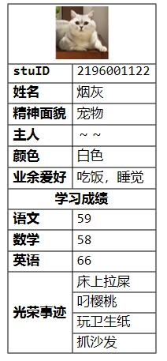
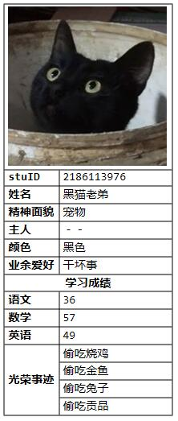

用mathematica可以制作一些宠物名片
<!--more-->
```mathematica
Clear["`*"];
p={{Item[烟灰.png,Alignment->Center],SpanFromLeft},
{"stuID","2196001122"},{"姓名","烟灰"},{"精神面貌","宠物"},{"主人","～～"},{"颜色","白色"},{"业余爱好","吃饭，睡觉"},{Item[Style["学习成绩",Bold],Alignment->Center],SpanFromLeft},{"语文","59"},
{"数学","58"},{"英语","66"},{Item[Style["光荣事迹",Bold],Alignment->Center],"床上拉屎"},{SpanFromAbove,"叼樱桃"},{SpanFromAbove,"玩卫生纸"},{SpanFromAbove,"抓沙发"}};

p[[2;;7,1]]=Style[#,Bold]&/@p[[2;;7,1]];
p[[9;;11,1]]=Style[#,Bold]&/@p[[9;;11,1]];
Grid[p,Alignment->Left,Frame->All]
```
```mathematica
Clear["`*"];
q={{"光荣事迹",SpanFromLeft,SpanFromLeft,SpanFromLeft},{"偷吃烧鸡","偷吃金鱼","偷吃兔子","偷吃贡品"}}//Transpose;
p={{Item[黑猫.png,Alignment->Center],SpanFromLeft},
{"stuID","2186000417"},{"姓名","黑猫老弟"},{"精神面貌","宠物"},{"主人","－－"},{"颜色","黑色"},{"业余爱好","干坏事"},{Item[Style["学习成绩",Bold],Alignment->Center],SpanFromLeft},{"语文","36"},
{"数学","57"},{"英语","49"}
,{Item[Style["光荣事迹",Bold],Alignment->Center],"偷吃烧鸡"},{SpanFromAbove,"偷吃金鱼"},{SpanFromAbove,"偷吃兔子"},{SpanFromAbove,"偷吃贡品"}};
p[[2;;7,1]]=Style[#,Bold]&/@p[[2;;7,1]];
p[[9;;11,1]]=Style[#,Bold]&/@p[[9;;11,1]];
Grid[p,Alignment->Left,Frame->All]
```





