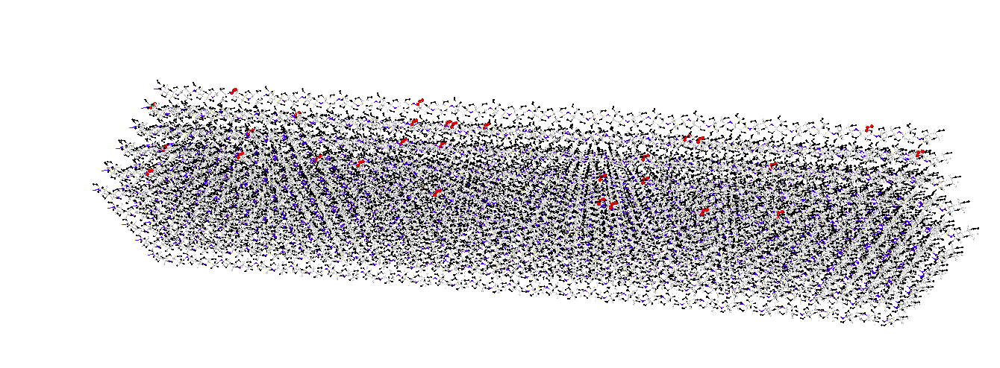

**今天终于把charmm力场氧化纤维晶体的建模问题搞定了，其实对于其他力场也大同小异。
还是LAMMPS自带的建模功能牛逼。码住，这个得好好写写！**
  <!--more-->
## 概述
纤维素晶体最常见的氧化形式是TEMPO晶体。具体形式是将纤维素晶体表面的羟甲基氧化为羧基，氧化度为0.1\~0.5（另：硫化程度一般为0.1\~0.2）。对于charmm力场，目前已有学者实现了纤维素晶体的建模（cellulose-toolkit）,但是由于模型建立的复杂性，目前对表面氧化的研究较少。（已有研究使用了oplsaa力场：Biomacromolecules 2020, 21, 3069−3080）
## 基本思路
一般来说，高分子data文件中会把力场参数包括在内。\
两个原因：1 高分子体系中参数较多写在in文件中不方便。2 输出的不同类型原子之间的pair_coeff会根据混合规则（pair_modify）进行计算，因此不同混合规则下的pair_coeff是不同的。索性直接把单个类型原子的pair_coeff写在data文件中，而在in文件中声明混合规则。
除此之外，也可以直接用include命令加入力场参数。这样就实现了力场参数与拓扑结构的分别读入。注意两点：1 虽然力场参数与拓扑结构是分别读入的，但是拓扑结构必须与对应的力场一致，例如不能读入charmm力场参数的同时使用oplsaa的拓扑结构。因为不同力场的原子类型不同。2 力场参数可以有冗余！这一点很重要，也就是说力场参数即使设置的多了有部分没有使用也不要紧。
明白了上面两点，氧化纤维素晶体的建模本质上分为三个部分：
+ 1 得到氧化纤维素晶体的Coeff参数文件 
+ 2 更改纤维晶体的拓扑结构

第一步可以通过在纤维素晶体的data文件中加入力场参数，然后用lammps自带的命令write_coeff得到想要的参数文件。（善于利用lammps自身的建模功能能解决很多问题。）
加入力场参数可以通过python脚本实现，这里注意读入的data文件必须为lammps输出的标准data文件。
```python
# -*- codeing = utf-8 -*-
# @Time :2022/9/9 23:34
# @Author : 得意喵 ~
# @File : addcoeff.py.py
# @Software: PyCharm
import pandas as pd
import numpy as np
import re
#define functions
def findcoeff(data,coeff):
    for i in range(len(data)):
        if re.match(coeff,data[i]):
            return i
def coeffformat(n,coeff0):
    return str(n)+' '+coeff0+'\n'
def getcoeffindex(coeff0):
    s=coeff0.split()
    return int(s[0])
def addcoeffs(data,n,coeff,n0):
    for i in range(len(coeff)):
        data.insert(n+i,coeffformat(n0+i+1,coeff[i]))
    return data
#open files
f=open('try.data','r')
data=f.readlines()
if data[10]=='\n':
    data.insert(10,'0 impropers\n')
    data.insert(11,'0 improper types\n')
    data.insert(findcoeff(data,'Atom')-1,'\n')
    data.insert(findcoeff(data,'Atom')-1,'Improper Coeffs\n\n')
#types and coeffs
new_atomtypes=2
new_bondtypes=2
new_angletypes=5
new_dihedraltypes=2
new_impropertypes=1
new_types=[2,2,5,2,1]
newmasses=['12.011','15.999']
newpaircoeffs=['0.07000000000000 3.56359487256136 0.07000000000000 3.56359487256136','0.12000000000000 3.02905564167715 0.12000000000000 3.02905564167715']
newbondcoeffs=['525.000   1.2600','200.000   1.4800']
newanglecoeffs=['40.00000  114.00000   50.00000    2.38800','100.00000  132.00000   70.00000    2.22500','50.00000  109.50000    0.00000    0.00000','45.00000  103.00000    0.00000    0.00000','52.00000  108.00000    0.00000    0.00000']
newdihedralcoeffs=['0.0500        6          180 1.00','0.6400        2          180 1.00']
newimpropercoeffs=['96.000     0.00']
new_coeff=[newmasses,newpaircoeffs,newbondcoeffs,newanglecoeffs,newdihedralcoeffs,newimpropercoeffs]
coeffindex=[];
index=['Pair Coeffs','Bond Coeffs','Angle Coeffs','Dihedral Coeffs','Improper Coeffs','Atoms']
#change types
types=data[3:13:2]
for i in range(5):
    s=types[i].split()
    s[0]=str(int(s[0])+new_types[i])
    types[i]=' '.join(s)+'\n'
data[3:13:2]=types
#add coeffs
for i in range(6):
    coeffindex.append(findcoeff(data,index[i]))
    if re.match('\d.',data[coeffindex[i]-2]):
        data=addcoeffs(data,coeffindex[i]-1,new_coeff[i],getcoeffindex(data[coeffindex[i]-2]))
    else:
        data.insert(coeffindex[i]-1,coeffformat(1,new_coeff[i][0]))
data1 = open("data_new.data", "w")
data1.write("".join(data))
data1.close()
f.close()
```
第二步可以通过lammps的建模功能实现。首先注意到，纤维素和氧化纤维素的模型如下图：


可以看出氧化后相比于氧化前只少了羟甲基上的羟基原子。同时很有意思的一点是氧化后羧基碳上两个氧原子的类型是一样的，这与未氧化羟甲基碳上的两个相同类型的氢原子不谋而合。因此只要把羟基删去并重新更改氧化后的top信息就可以实现纤维素氧化，（不用增加其他的原子以及多余的top信息，除了增加一个离面二面角）。
氧化前后的top信息总结如下：
[氧化前后力场参数对比](https://s2.loli.net/2022/09/12/5HaRedEVNQ4cZul.png)
不同的力场参数是通过charmmgui得到氧化前后多糖data文件对照后得出的。
通过lammps自带命令改变原来data文件的top结构并赋予力场参数，可以实现羟甲基氧化为羧基后糖单元的charmm力场模型。
```bash
units real
atom_style full
dimension 3
boundary f f f
#Force fields
bond_style harmonic
angle_style charmm
dihedral_style charmmfsw
improper_style  harmonic 
pair_style lj/charmmfsw/coul/charmmfsh 10.0 12.0
pair_modify mix arithmetic
read_data withoutcoeff.data extra/improper/per/atom 5
special_bonds charmm
neighbor 2.0 bin
neigh_modify every 100 delay 0 check yes
include Oxide.coeff
# define groups
group HO id 48 47
group OO id 45 46
group C id 44
#add coeff
# the coeff must be added to data file not the coeff file
# it has been done with python code
#1 delete_atoms  
delete_atoms group HO bond yes
#2 set charge
set group OO charge -0.760
set group C charge   0.520
# # # #3 set pair 
set group OO type 16
set group C type  15
#4 set bond angle dihedral 

########### Bond ###########
group bondOC  id 44 45 46
set group bondOC bond 20
group bondCC  id 44 29
set group bondCC bond 21
########### Angle ###########
group angle1  id 29 44 45
set group angle1 angle 40
group angle2  id 29 44 46
set group angle2 angle 40
group angle3  id 45 44 46
set group angle3 angle 41
group angle4  id 30 29 44
set group angle4 angle 42
group angle5  id 31 29 44
set group angle5 angle 43
group angle6  id 40 29 44
set group angle6 angle 44
########### Dihedral ###########
group dihedral1  id 30 29 44 45
set group dihedral1 dihedral 91
group dihedral2  id 30 29 44 46
set group dihedral2 dihedral 91
group dihedral3  id 31 29 44 45
set group dihedral3 dihedral 92
group dihedral4  id 31 29 44 46
set group dihedral4 dihedral 92
group dihedral5  id 40 29 44 45
set group dihedral5 dihedral 91
group dihedral6  id 40 29 44 46
set group dihedral6 dihedral 91
#create and set improper
create_bonds single/improper 1 44 29 46 45
write_coeff Oxide.coeff
write_data withoutcoeff.data nocoeff
```
至此我们已经完成了羟甲基到羧基的氧化。
后面基本上就大功告成了，要实现纤维素晶体的氧化只用在ovito中把羟甲基碳的原子序号找出来，把产生变化的原子序号写成选出的碳原子序号的表达式并用随机数选取进行氧化。（lammps中一个loop循环就可以搞定。）

放个图感受一下，哈哈哈。
原理一样，氧化过程中需要注意：

+ 1 variable中的随机数会随着调用次数进行变动，因此新建一个变量把它存储下来！！

+ 2 及时删除group！！
```bash
units real
atom_style full
dimension 3
boundary f f f
#Force fields
bond_style harmonic
angle_style charmm
dihedral_style charmmfsw
improper_style  harmonic 
pair_style lj/charmmfsw/coul/charmmfsh 10.0 12.0
pair_modify mix arithmetic
read_data crystal_nocoeff.data extra/improper/per/atom 500
special_bonds charmm
neighbor 2.0 bin
neigh_modify every 100 delay 0 check yes
# write_data crystal_new.data
include crystal.coeff

variable NS loop 30

label loop
variable seed equal ${NS}^2+2*${NS}+3932
variable a290 equal round(random(0,1,${seed})*180)*42+34443
variable a29 equal ${a290}
print " ${a29} "
# variable a29 equal 36921
variable a44 equal ${a29}+14
print " ${a29} "
variable a45 equal ${a29}+15
print " ${a29} "
variable a46 equal ${a29}+16
variable a47 equal ${a29}+17
variable a48 equal ${a29}+18

# define groups
group HO id ${a47} ${a48}
group OO id ${a45} ${a46}
group C id ${a44}
#add coeff
# the coeff must be added to data file not the coeff file
# it has been done with python code
#1 delete_atoms  
delete_atoms group HO bond yes
#2 set charge
set group OO charge -0.760
set group C charge   0.520
# # # #3 set pair 
set group OO type 12
set group C type  11
#4 set bond angle dihedral 

########### Bond ###########
group bondOC  id ${a44} ${a45} ${a46}
set group bondOC bond 16
group bondCC  id ${a44} ${a29}
set group bondCC bond 17


########### Angle ###########
group angle1  id ${a29} ${a44} ${a45}
set group angle1 angle 33
group angle2  id ${a29} ${a44} ${a46}
set group angle2 angle 33
group angle3  id ${a45} ${a44} ${a46}
set group angle3 angle 34
group angle4  id 30 ${a29} ${a44}
set group angle4 angle 35
group angle5  id 31 ${a29} ${a44}
set group angle5 angle 36
group angle6  id 40 ${a29} ${a44}
set group angle6 angle 37
########### Dihedral ###########
group dihedral1  id 30 ${a29} ${a44} ${a45}
set group dihedral1 dihedral 84
group dihedral2  id 30 ${a29} ${a44} ${a46}
set group dihedral2 dihedral 84
group dihedral3  id 31 ${a29} ${a44} ${a45}
set group dihedral3 dihedral 85
group dihedral4  id 31 ${a29} ${a44} ${a46}
set group dihedral4 dihedral 85
group dihedral5  id 40 ${a29} ${a44} ${a45}
set group dihedral5 dihedral 84
group dihedral6  id 40 ${a29} ${a44} ${a46}
set group dihedral6 dihedral 84
#create and set improper
create_bonds single/improper 1 ${a44} ${a29} ${a46} ${a45}

group HO        delete 
group OO        delete
group C         delete
group bondOC    delete
group bondCC    delete
group angle1    delete
group angle2    delete
group angle3    delete
group angle4    delete
group angle5    delete
group angle6    delete
group dihedral1 delete
group dihedral2 delete
group dihedral3 delete
group dihedral4 delete
group dihedral5 delete
group dihedral6 delete
# delete_atoms group HO bond yes
next NS
jump SELF loop
write_data Oxide.data nocoeff
```

