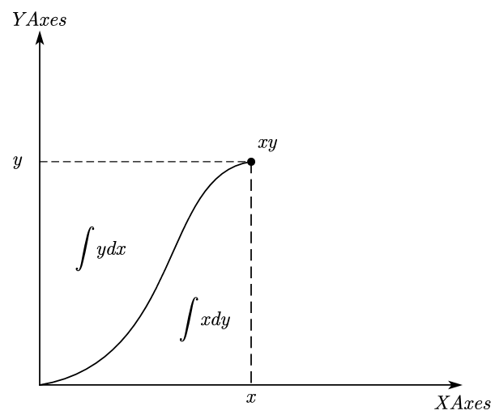

分部积分并非高数中表现的那么简单单纯，这个东西在变分过程中会经常用到。
<!--more-->
之前发现过一些关于分部积分有趣的性质，记录如下：
## **分部积分公式的几何意义**
$\int ydx=xy-\int x dy$
即为：   
$xy=\int ydx+\int x dy$

分部积分中的两部分在力学中表现为应变能与应变余能。
## **高阶公式以及在变分法中的应用**
$\int gf'dx+\int fg'dx=gf$
$\int gf''dx-\int fg''dx=gf'-fg'$
$\int gf'''dx+\int fg'''dx=f''g-f'g'+fg''$
一般地可表示为:  
$\int gf^{\alpha}dx+(-1)^{\alpha+1}\int fg^{\alpha}dx=\Sigma_{i=0}^{\alpha-1}(-1)^{i}f^{\alpha-1-i}g^{i}$   
Euler's Elastica Rod控制方程求解中，泛函可以写成如下形式：   
$\frac{1}{2}\int |\boldsymbol{r}''|^2+\Lambda*(|\boldsymbol{r}'|^2-1)ds$   
$\boldsymbol{r} \rightarrow \boldsymbol{r}+\boldsymbol{\epsilon W}$   
求变分后得到   
$\int \Lambda \boldsymbol{r}'\boldsymbol{W}'+\boldsymbol{r}''\boldsymbol{W}''ds=0$   
此时上面的公式就派上用场了，直接带入得到：   
$(\Lambda \boldsymbol{r}'\boldsymbol{W}+\boldsymbol{r}''\boldsymbol{W}'-\boldsymbol{r}'''\boldsymbol{W})|_{s_1}^{s_2}+\int(\boldsymbol{r}''''-(\Lambda\boldsymbol{r}')')ds=0$

**上面那个一般性公式有没有更好看更对称的写法?**

**如何从给定泛函中直接看出变分后的结果?**   

分部积分公式的正负交错导致了含有高阶项拉格朗日方程的正负交错结果！
(我也能从单变量泛函中直接看出来变分后的结果了！)
## **含高阶导数的Lagrange方程的一般形式：**    
利用上面的一般性分部积分公式，可以得到含高阶导数的Lagrange方程的一般形式：     
$\int{\Sigma _{p=0}^{n}\left( -1 \right) ^p\frac{d^p}{dx^p}\left( \frac{\partial L}{\partial y_p} \right) \epsilon dx}+\Sigma _{p=0}^{n}\Sigma _{i=0}^{p-1}\left( -1 \right) ^i\epsilon _{p-1-i}\frac{d^i}{dx^i}\left( \frac{\partial L}{\partial y_p} \right)=0$   
得到高阶Lagrange方程为：   
$\Sigma _{p=0}^{n}\left( -1 \right) ^p\frac{d^p}{dx^p}\left( \frac{\partial L}{\partial y_p} \right)=0$   
若满足诺特定理，守恒量为：   
$\Sigma _{p=0}^{n}\Sigma _{i=0}^{p-1}\left( -1 \right) ^i\epsilon _{p-1-i}\frac{d^i}{dx^i}\left( \frac{\partial L}{\partial y_p} \right)$
