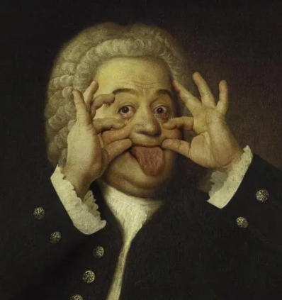
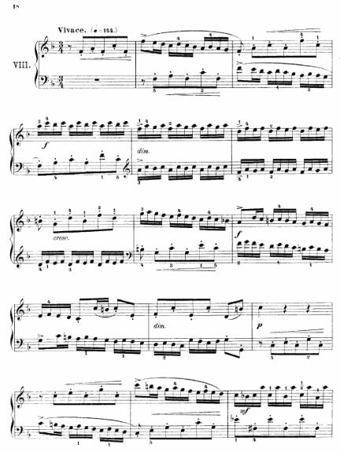
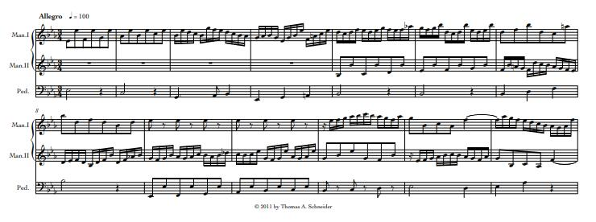
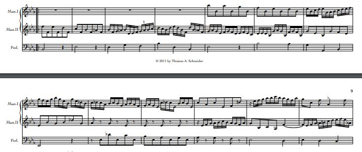

## Bach的音乐中有着对称美。
<!--more-->
**平移对称性**体现在在不同的时间内交错地再现主题

**反演对称性**体现在利用倒影（旋转180°）手法创作其他声部

利用mathematica可以更加清楚的揭示声部之间的关系。

举个例子：

**二部创意曲第八条**



可以看出，上下两个声部几乎是完全一样的，只不过在时间维度上错开了。

利用mathematica可以对这一小段进行在创作

代码如下：

首先，把需要的音符和时值写进去
```mathematica
Clear["`*"]
{a, b, c, d} = 0.5*{1, 0.5, 0.25, 0.125};

{c4, d4, e4, f4, g4, a4, b4} = {0, 2, 4, 5, 7, 9, 11};
{c5, d5, e5, f5, g5, a5, b5} = {c4, d4, e4, f4, g4, a4, b4} + 12;
{c6, d6, e6, f6, g6, a6, b6} = {c5, d5, e5, f5, g5, a5, b5} + 12;
bb4 = 10;
bb5 = 22;

time1 = ConstantArray @@@ {{b, 7}, {c, 10}, {b, 6}, {c, 36}, {b, 
      6}, {c, 12}, {b, 1}, {c, 14}, {b, 1}, {c, 2}, {b, 8}, {a, 1}} //
    Flatten;
note1 = {None, f4, a4, f4, c5, f4, f5,
   e5, d5, c5, d5, c5, bb4,
   a4, bb4, a4, g4,
   f4, a4, c5, a4, f5, c5, a5, c6, bb5, c6, a5, c6, bb5, c6, a5, c6, 
   bb5, c6, f5, a5, g5, a5, f5, a5, g5, a5, f5, a5, g5, a5, d5, f5, 
   e5, f5, d5, f5, e5, f5, d5, f5, e5, f5, b4, g4, d5, b4, f5, d5, g5,
    a5, g5, f5, e5, f5, e5, d5, c5, d5, c5, bb4, a4, d5, c5, b4, c5, 
   b4, a4, g4, a4, g4, f4, e4, f4, e4, d4, c4, c5, b4, c5, e4, f4, c5,
    e4, c5, d4, b4, c5};
```
然后，原曲（大概的，保持了两个声部的一致性）：
```mathematica
Audio@Sound@MapThread[SoundNote[#1, #2, "Piano"] &, {note1, time1}] + 
 Audio@Sound@
   MapThread[
    SoundNote[#1, #2, "Piano"] &, {Join[ConstantArray[None, 3], 
      note1], Join[{a, a, a}, time1]}]
```
### 错开五度
```mathematica
Audio@Sound@
   MapThread[SoundNote[#1, #2, "Piano"] &, {7 + note1, time1}] + 
 Audio@Sound@
   MapThread[
    SoundNote[#1, #2, "Piano"] &, {Join[ConstantArray[None, 3], 
      note1], Join[{a, a, a}, time1]}]
```
### 错开四度
```mathematica
Audio@Sound@
   MapThread[SoundNote[#1, #2, "Piano"] &, {5 + note1, time1}] + 
 Audio@Sound@
   MapThread[
    SoundNote[#1, #2, "Piano"] &, {Join[ConstantArray[None, 3], 
      note1], Join[{a, a, a}, time1]}]
```
### 倒映
```mathematica
Audio@Sound@MapThread[SoundNote[#1, #2, "Piano"] &, {-note1, time1}] +
  Audio@Sound@
   MapThread[
    SoundNote[#1, #2, "Piano"] &, {Join[
      ConstantArray[None, 3], -note1], Join[{a, a, a}, time1]}]
```
这一段是不是有巴赫内味了？(இωஇ )
### 两个声部互为**倒映**：
```mathematica
Audio@Sound@MapThread[SoundNote[#1, #2, "Piano"] &, {note1, time1}] + 
 Audio@Sound@
   MapThread[
    SoundNote[#1, #2, "Piano"] &, {Join[
      ConstantArray[None, 3], -note1], Join[{a, a, a}, time1]}]
```
这个听起来不是很舒服。

除此之外，还可以用不同乐器演奏不同的声部，突出声部的独立性。
```mathematica
Audio@Sound@
   MapThread[SoundNote[#1, #2, "Violin"] &, {12 - note1, time1}] + 
 Audio@Sound@
   MapThread[
    SoundNote[#1, #2, "Bassoon"] &, {Join[ConstantArray[None, 3], 
      7 - note1], Join[{a, a, a}, time1]}]
```
用小提琴演奏高音声部，巴松演奏低音声部。

应该还有好多好玩的。

我创作了一段，第一段用原旋律＋平移对称性，第二段用倒映手法：
```mathematica
Audio@Sound@
   MapThread[
    SoundNote[#1, #2, "Violin"] &, {7 + note1~Join~(7 - note1), 
     time1~Join~time1}] + 
 Audio@Sound@
   MapThread[
    SoundNote[#1, #2, 
      "Piano"] &, {Join[ConstantArray[None, 3], note1]~Join~
      Join[ConstantArray[None, 3], 12 - note1], 
     Join[{a, a, a}, time1]~Join~Join[{a, a, a}, time1]}]
```
是不是感觉和这首管风琴奏鸣曲的手法很像？

bwv525, 也是旋律＋倒映分为两段进行拼接的。

看**第三乐章**：

第一段：

第二段：

